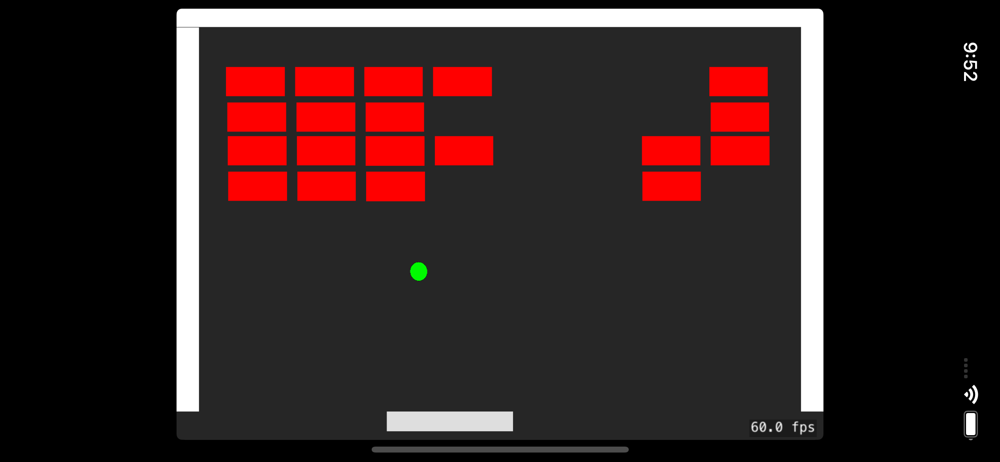

# SwiftBreak
Swift SpriteKit Breakout Game in only 50 lines of code added to Xcode template

I created thsi example in class at Wright State University CS-3170 "Mobile Apps" in 2021 to demonstrate SpriteKit based animation and physis.

